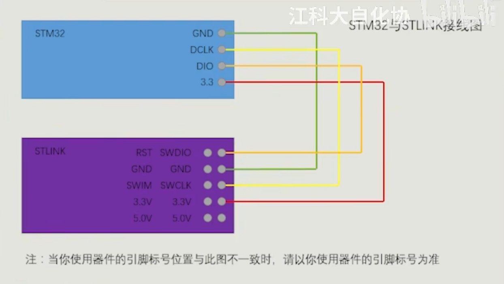

入门视频教程：[bilibili](https://www.bilibili.com/video/BV1th411z7sn)

芯片型号：`STM32F103C8T6`

接线：

遇到的一些问题以及解决方法：

- [Keil5使用STlink进行Debug时闪退问题解决](https://blog.csdn.net/qq_52251819/article/details/135567609)